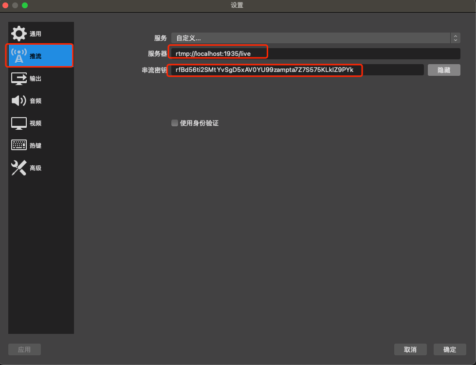
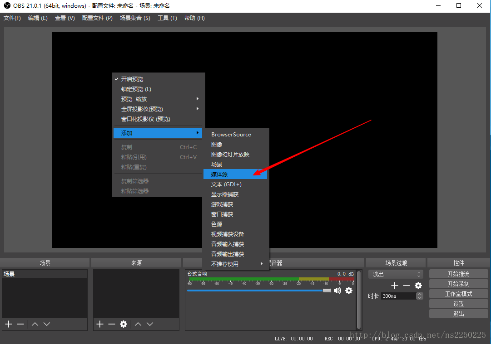
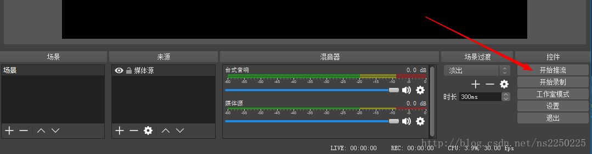
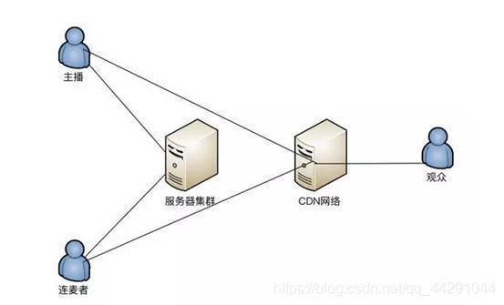
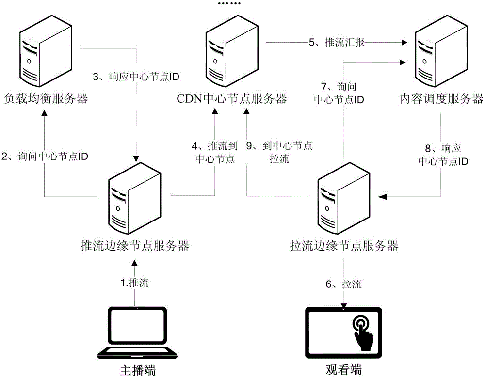

# LiveGO+OBS+Flv.js

## LiveGO部署及使用

### 部署

- docker部署
   
```docker
docker run -p 1935:1935 -p 7001:7001 -p 7002:7002 -p 8090:8090 -d gwuhaolin/livego
```
- 源码编译部署

```shell
1. 下载源码git clone https://github.com/gwuhaolin/livego.git
2. 去 livego 目录中 执行 go build
```

### 使用

- 启动服务：执行 `livego` 二进制文件启动 `livego` 服务；
- 获取房间channelkey：访问 http://localhost:8090/control/get?room=movie (channelkey用于推流，movie用于播放).
- 推流: 通过RTMP协议推送视频流到地址 `rtmp://localhost:1935/{appname}/{channelkey}` (appname默认是live), 
  例如： 使用 `ffmpeg -re -i demo.flv -c copy -f flv rtmp://localhost:1935/live/{channelkey}` 推流;
- 播放: 支持多种播放协议，播放地址如下:
   - RTMP:rtmp://localhost:1935/live/{channelkey}
   - FLV:http://127.0.0.1:7001/live/{channelkey}.flv
   - HLS:http://127.0.0.1:7002/live/{channelkey}.m3u8
   
- 查看live状态：

```shell
http://127.0.0.1:8090/stat/livestat
```
- 重新生成channelkey

```shell
http://127.0.0.1:8090/control/reset?room=ROOM_NAME
```
- 删除房间

```shell
http://127.0.0.1:8090/control/delete?room=ROOM_NAME
```

## OBS
- 配置OBS


- 添加媒体源，添加一个本地的flv文件即可

  
- 开始推流


## 流媒体服务器
流媒体在播放之前都要通过服务器进行过传输，从而实现播放行为


### 1.什么是流媒体服务器？
> 流媒体是将一连串的媒体数据压缩后，经过网上分段发送数据，进行网上即时传输，是边下载边观赏影音的一种技术和过程。使得数据包像水流一样发送，如果不适用此技术，必须在使用之前下载整个流媒体文件。

> 流媒体服务器是流媒体应用的核心系统，在流媒体技术中承担了对音频，视频，图片等进行采集，缓存，调度和传输播放等功能。

> 流媒体服务器既然是在网络上输送流媒体数据到数据客户端，就一定涉及传输协议。流媒体服务器最常采用的协议有：RTMP,RTP,RTSP等。

### 2.流媒体服务器的传输方式有哪些？

主要传输方式有：`顺序流式传输`和`实时流式传输`
   - 顺序流式传输：即顺序下载，在下载文件的同时，用户可以观看在线媒体。如果使用普通的HTTP服务器，将音视频数据通过从头到尾的方式进行发送即为顺序流媒体传输。
   - 实时流式传输：总是实时传送，非常适合现场事件。比如视频为现场直播或者是使用专用的流媒体服务器，可以应用像RTSP等专用实时协议。实时流式传输必须要匹配链接宽带，也意味着图像质量会因网络速度的降低而变差。


> 以上就是流媒体服务器的主要内容和原理，而且在流式传输的过程中，流媒体数据是具有实时性和等时性等基本特点的，流服务器和客户终端需要保证各种媒体之间的同步关系。由此可见，在开发过程中需要注意和兼顾的问题有很多。所以在直播平台建设的过程中，流媒体传输对于最大延时和延时抖动等参数的严格要求是需要特别注意的。

### 点量流媒体服务器和普通服务器有什么区别？
> 点量流媒体服务器除了能实现视频服务器所有功能外，点量流媒体流媒体服务器还可以实现直播转播大并发，加密​‌‌防盗，边下边播功能，结合ott点播系统使用效果更佳！

> 点量流媒体服务器可以把连续的音频和视频信息压缩后​‌‌放到网络服务器上，用户边下载边观看，而不必等待整个文件下载完毕。基于点量流媒体技术的优越性，点量流媒体服务器广泛应用于视频点播、视频会议、远程教育、远程医疗和在线直播系统中：


